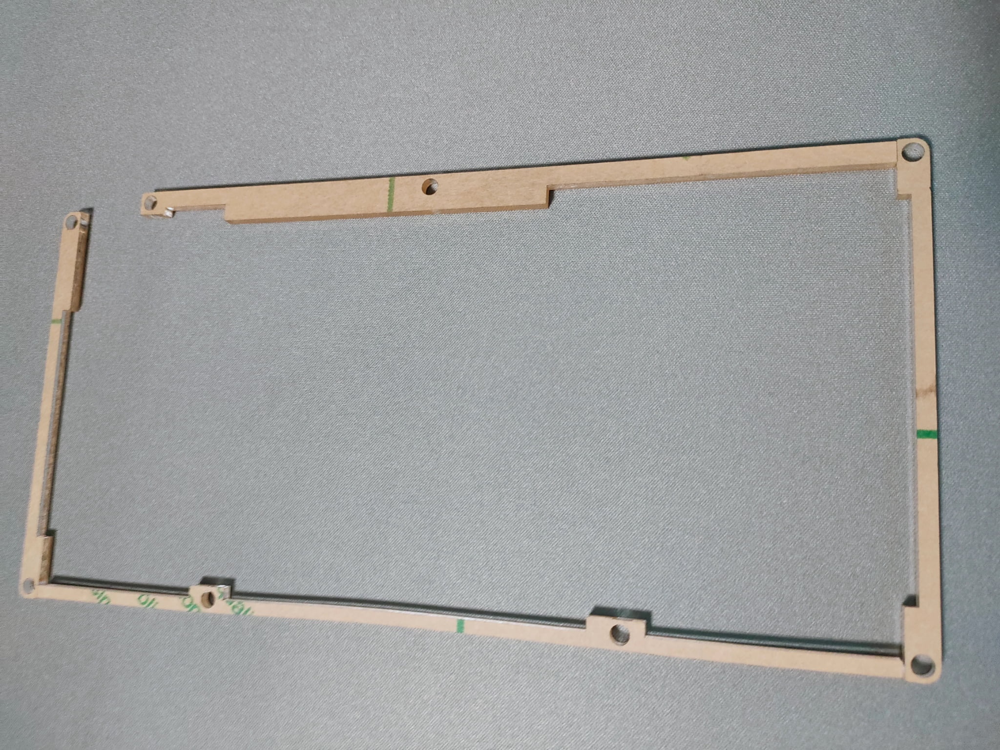
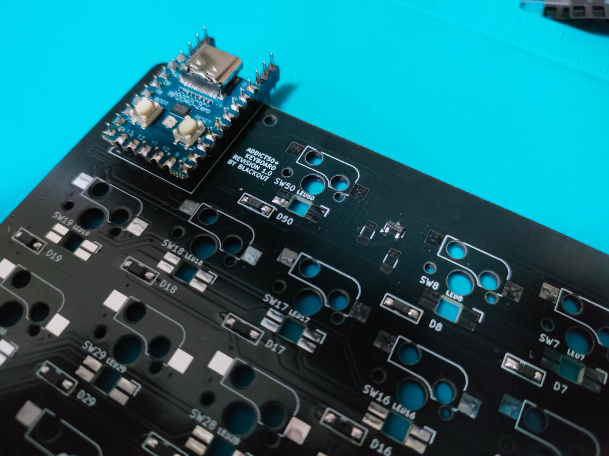

# addict50plus Keyboard BUILD GUIDE

# PARTS LIST

PCB board and each acrylic plate.

The bottom middle plate has a frame shape.

# FIRMWARE

First, install the Vial firmware on the microcontroller and test whether it works.

While pressing the BOOT button on the RP2040-ZERO, connect it to the PC using the USB Type-C cable.

Since it starts with mass storage, copy the addict50plus_Vial.uf2 file into the automatically opened folder.

The file can be downloaded from my GitHub.

After restarting the microcomputer, check if you can connect from the Vial homepage using the Vial app or browser.

If the connection is successful, the default keymap will be displayed.

You can freely change the key settings on this screen.

For details, refer to the Vial keyboard site.

# SOLDERING

Solder the components to the board.

Solder the diode first.

The frame to the left of the letter D1 is where the diode will be installed.

Install it so that the vertical line on the diode surface is on the left.

I think it will be easier to work if you solder it to one side of the board in advance.

Diode Solder in the same direction except for D51, where a rotary encoder can be attached.

Next, solder the MOSFET and chip resistor for the LED level shift circuit.

The small part in the image is the MOSFET.

If you are not attaching an LED, you can skip this step.

Like the diode, I think it will be easier to install if you solder it to one spot on the board in advance.

These two chip resistors are also soldered to one side of the board and then installed.

The installed resistor has no directionality, so it can be installed in either direction.

Next, attach the LED, but if you are not attaching an LED, you can omit this.

If you are using a temperature-controlled soldering iron, you can usually solder at around 330℃ using leaded solder, but it is better to lower the temperature a little more than that, which may damage the LED.

I think this can be prevented.

If you do not have a temperature-controlled soldering iron, I think it is a good idea to avoid applying the soldering iron to one LED continuously for a long time.

If you have a test microcontroller, check the LED operation here.

RED

GREEN

BLUE

Install all LEDs so that the terminal with the notch is at the mark on the top right.

As with other mounting parts, I think it will be easier to install if you solder that part in advance.

Next, install the socket for the MX switch in the same direction as the mark on the board.

I think it will be easier to work if you solder only the pad on one side as shown in the photo.

Only SW51 has the option to select either a key switch or a rotary encoder.

If you want to attach a rotary encoder, I think it is better to solder the microcontroller first and then install it.

For the diode D51, make sure the vertical line is at the bottom. 

Install in the direction shown in the image.

To install the microcomputer, set it as shown in the photo.If you set the short end of the pin header included with RP2040-ZERO on the microcomputer side, the height will be just right and it will be easier to work.

Solder the short end of the pin header. 

There is no need to cut it because the height will be just right.

Solder from the end of each pin header to prevent it from shifting, then solder all pins.

Soldering complete.

On this side, cut off the extra length of the pin header with nippers and solder all the pins.

Soldering complete.
# CASE

Installation order of each plate 
1. Insert the screw from the top side of the PCB board and attach the spacer.
2. Place the 3mm middle acrylic on the bottom side so that it fits into the spacer hole.
3. Place the 2mm acrylic on the bottom side and attach it with screws.

The image of the installed spacer. 
viewed from the side is upside down.

Peel off the bottom middle acrylic protective sheet. Be careful not to break it as it is thin.

Attach the middle plate by fitting the spacer into the acrylic hole.

Place the middle plate in a frame shape as shown in the image.

Place 2mm of acrylic on the bottom side and secure with screws.

The rubber feet stabilize the position of the image.When using a rotary encoder, I think it will be easier to push the button if you attach the rubber feet near the rotary encoder.

Peel off the protective sheet from the top two acrylic sheets and place them on the board.

Just place it in the order of middle → top

Insert the key switch starting from the outer corner.

All key switches installed.
# TEST

Connect it to a computer with a USB cable, and if you have attached an LED, turn it on and test.

I think the way it looks will change depending on the design of the key switch and the color of the housing.

The LED immediately to the left of the microcontroller is a layer indicator. 

The color changes independently because.
# FINAL BUILD

Completed by attaching the keycaps. The rotary encoder knob is approximately 17mm in diameter.

# Enjoy your keyboard life!
